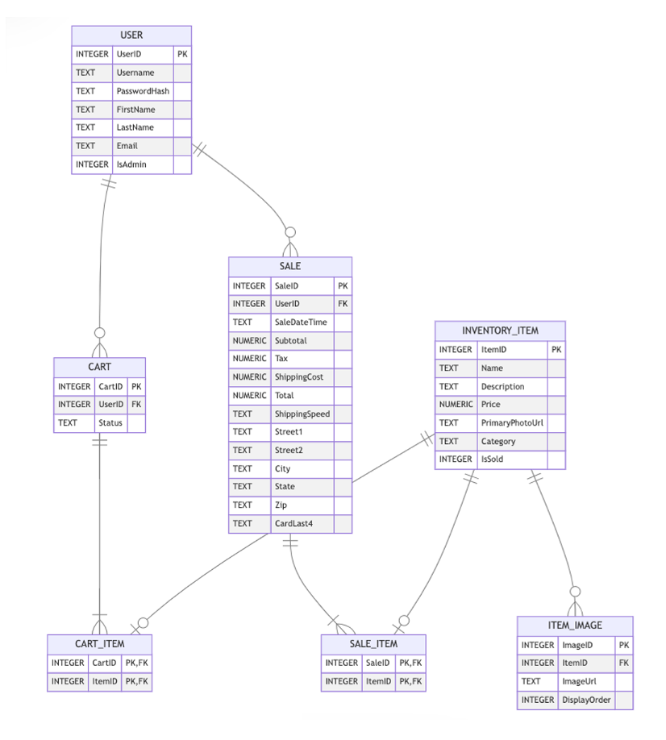
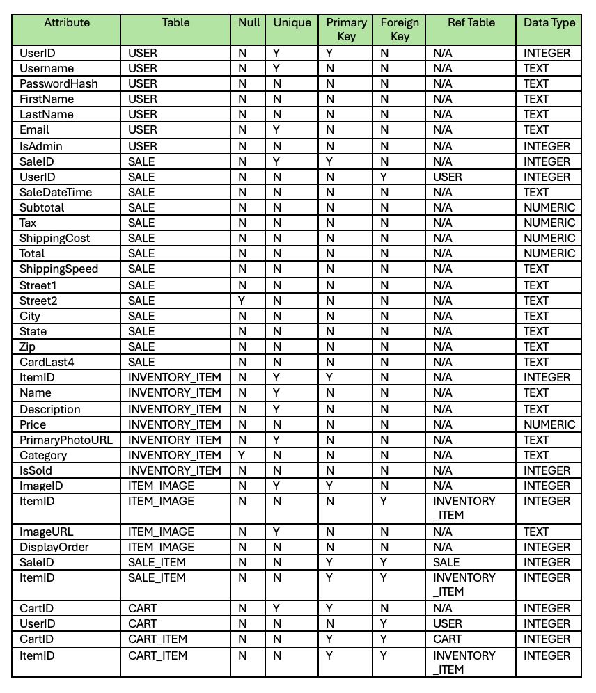
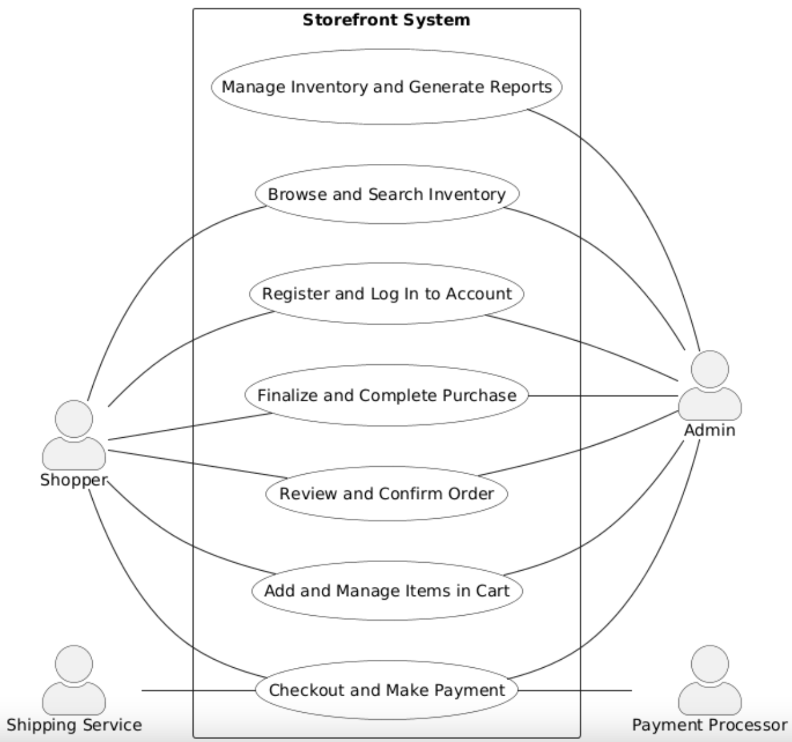

# Technical Design

This document defines the technical architecture and implementation approach for Offshore Holdings, a full-stack web application. It provides detailed specifications for the system's structure, data models, and technology stack to ensure a robust, maintainable solution.

## A. Implementation Language(s)

The application is implemented using the following languages:

#### Backend:
- **C#**: Server-side language for ASP.NET Core, providing strong typing, extensive library support, and built-in dependency injection. Chosen because C# syntax and object-oriented principles align closely with Java, leveraging existing team expertise.

#### Frontend:
- **TypeScript**:  Angular's primary language, offering type safety and compile-time error detection. 
- **HTML**: Markup language for UI structure and templates.  
- **CSS**: Styling language for visual design and layout.

#### Data:
- **SQLite**: SQLite is a lightweight, file-based relational database that stores all data in a single file (`offshore.db`). Unlike traditional database systems that require a separate server (like MySQL or PostgreSQL), SQLite runs directly within the application, making it ideal for development and single-user applications.
-  **JSON**: Serialization format for API request/response payloads between frontend and backend.  

## B. Implementation Framework(s)
We are using Angular as our front end framework. 
Isaac - explain why

## C. Data Storage Plan
### Storage Format
- **Engine:** SQLite  
- **Database File:** `offshore.db` stored on disk so data persists between application runs.

### C# Libraries / Technologies
- **Entity Framework Core 9.0** with the SQLite provider (ORM).
- **Connection string** stored in `appsettings.json`.

### Data Flow
- Angular sends HTTP requests to ASP.NET Core API endpoints.
- Controllers/services use `AppDbContext` to:
  - Query data  
  - Insert/update/delete entities  
  - Call `SaveChanges()` to write changes to the SQLite file  
- All domain objects are represented as EF Core entity classes and mapped to tables.

## D. Entity Relationship Diagram

## E. Entity/Field Descriptions

## F. Data Examples
Click [here](assets/example-data/example-data-README.md) for example data.
## G. Database Seed Data
Click [here](assets/seed-data/seed-data-README.md) for seed data.
## H. Authentication and Authorization Plan

#### Authentication
Authentication is handled by asking users and admins to enter their username and password. The password is then hashed and compared to the USER table in the SQLite database. If a match is found, the user/admin is allowed to log in. If a match is not found (i.e. invalid username or password), they are not allowed to log in.

#### Authorization
Authorization is handled by the IsAdmin field in the USER table. If it has a value of 0, the entry is a user. If set to 1, the entry is an admin. 

Users are able to search inventory, register and log in, complete purchases, confirm orders, add or remove items from their cart, and check out.
Admins can perform every action a user can in addition to admin specific actions. They can add items to the inventory, remove items from inventory, and generate sales reports.

## I. Coding Style Guide

Offshore Holdings requires that standard style guides be used for all implementation to ensure maintainabilty and longevity: 

- C# style guide can be located [here](https://learn.microsoft.com/en-us/dotnet/csharp/fundamentals/coding-style/coding-conventions)  
- Angular style guide can be located [here](https://angular.dev/style-guide#keep-components-and-directives-focused-on-presentation)  
- SQLite style guide can be located [here](https://www.sqlstyle.guide/)  

## Technical Design Presentation

Loom video goes [here](https://www.youtube.com/watch?v=dQw4w9WgXcQ) please update
