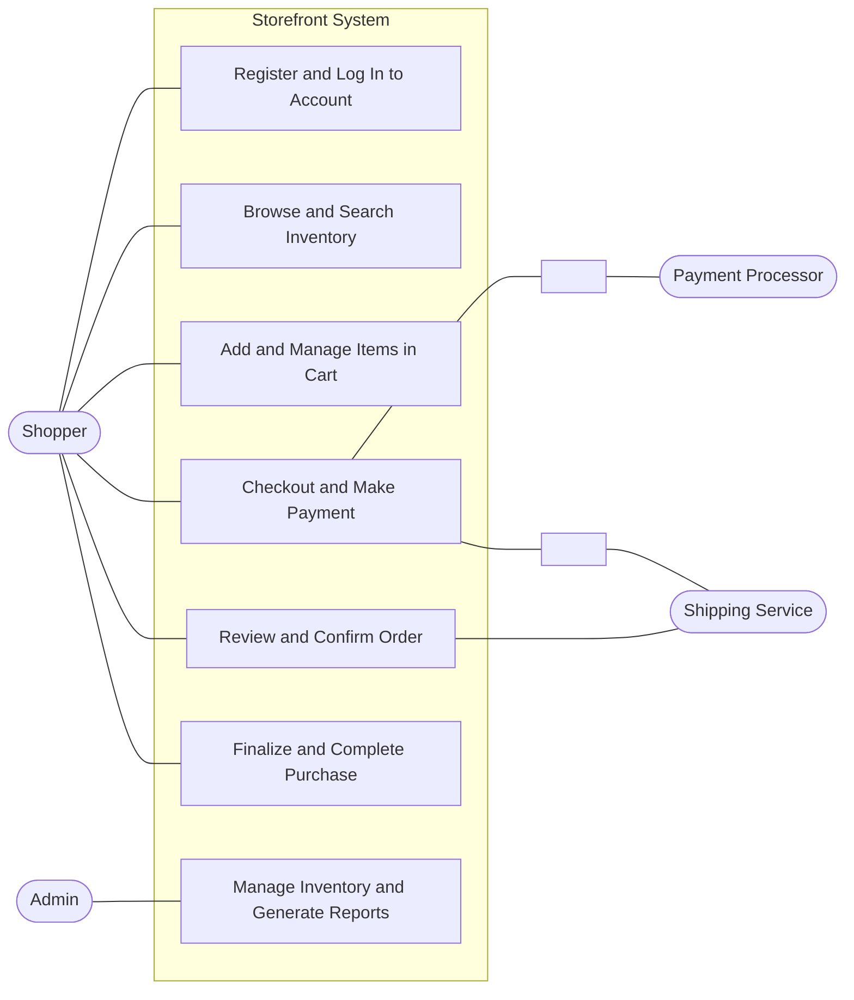

# Use Case Diagram

This page contains the use-case diagram for our E-commerce site

```mermaid
flowchart LR
    %% Direction: Left to Right
    %% Actors
    shopper(["Shopper"])
    admin(["Admin"])
    payment(["Payment Processor"])
    shipping(["Shipping Service"])

    %% Invisible spacing nodes
    spacer1[" "]:::invisible
    spacer2[" "]:::invisible

    %% System boundary
    subgraph System["Storefront System"]
        UC_Auth["Register and Log In to Account"]
        UC_Inventory["Browse and Search Inventory"]
        UC_Cart["Add and Manage Items in Cart"]
        UC_Checkout["Checkout and Make Payment"]
        UC_Confirm["Review and Confirm Order"]
        UC_Complete["Finalize and Complete Purchase"]
        UC_Admin["Manage Inventory and Generate Reports"]
    end

    %% Associations - shopper and admin on left
    shopper --- UC_Auth
    shopper --- UC_Inventory
    shopper --- UC_Cart
    shopper --- UC_Checkout
    shopper --- UC_Confirm
    shopper --- UC_Complete
    admin --- UC_Admin

    %% External systems - on right
    UC_Checkout --- spacer1 --- payment
    UC_Checkout --- spacer2 --- shipping
    UC_Confirm --- shipping
```
